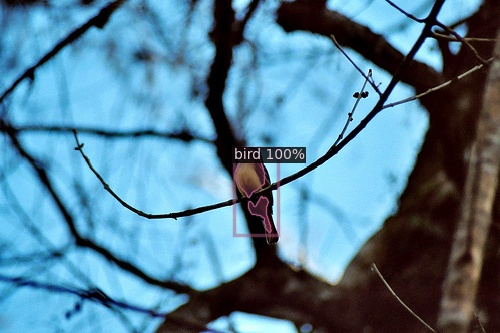
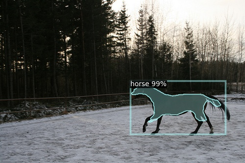
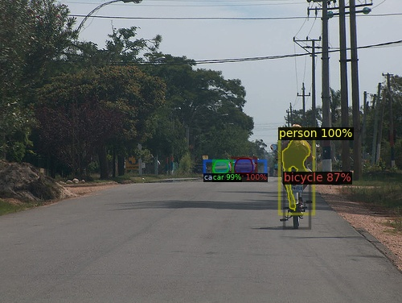
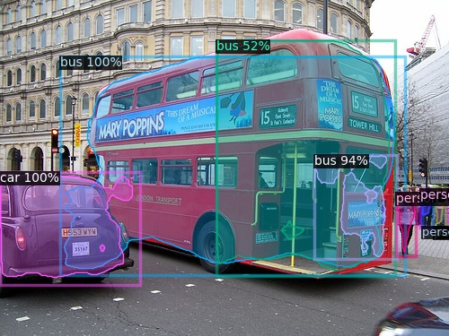

# Instance-Segmentation-on-Tiny-PASCAL-VOC-Dataset

###### tags: `Selected Topics in Visual Recognition using Deep Learning` `Instance Segmentation` `Detectron2`

This project is part of a series of projects for the course *Selected Topics in Visual Recognition using Deep Learning*. This Repository gathers the code for **instance segmentation** on tiny PASCAL VOC dataset.

In this instance segmentation task, we use [Detectron2](https://github.com/facebookresearch/detectron2), an software system that implements state-of-the-art object detection algorithms, developed by Facebook AI Research to conquer this task. [Mask R-CNN [2]](https://arxiv.org/abs/1703.06870) is the main model architecture in our project.

## Environment

Framework: PyTorch, detectron2

Platform: Ubuntu (Linux)

## Reproducing Submissoin
To reproduct my submission without retrainig, do the following steps:

1. [Installation](#Installation)
2. [Download Official Dataset](#Download-Official-Dataset)
3. [Project Structure](#Project-Structure)
4. [Dataset Preparation](#Dataset-Preparation)
5. [Inference](#Inference)

## Installation
### Requirements
- Linux or macOS with Python ≥ 3.6
- PyTorch ≥ 1.5 and torchvision that matches the PyTorch installation. You can install them together at pytorch.org to make sure of this
- OpenCV is optional and needed by demo and visualization

### Build Detectron2
```
# install it from a local clone:
git clone https://github.com/facebookresearch/detectron2.git
python -m pip install -e detectron2

# (Optional) install opencv for visualizing img
pip install opencv-python
```

If you encounter any problem, you can see other installation methods from [office installation](https://github.com/facebookresearch/detectron2/blob/master/INSTALL.md).

## Download Official Dataset
Download dataset from [Google drive](https://drive.google.com/drive/folders/1fGg03EdBAxjFumGHHNhMrz2sMLLH04FK). The data is in [COCO style format](https://cocodataset.org/#format-data).

## Project Structure
```
Root/
    infer.py                     # infer your testing data
    train.py                     # train your model
    detectron2                   # detectron2 project folder
    ├ ...
    config                       # configuration and experiments for different models
    ├ default.py                 # Default configuration
    ├ R50_FPN_ep1.yaml           # experiments 1
    ├ ...
    dataset
    ├── coco
    │   ├── annotations         
    │   │    ├ pascal_train.json # training data info
    │   │    ├ test.json         # testing data info
    │   ├── train2017 
    │   │    ├ 2007_000033.jpg
    │   │    ├ 2007_000042.jpg
    │   │    ├ ...
    │   ├── test2017
    │   │    ├ 2007_000629.jpg
    │   │    ├ 2007_001175.jpg
    │   │    ├ ...
```

## Dataset Preparation
[Download official dataset](#Download-Official-Dataset), then layout your directory and move downloaded dataset same as [Project Struture](#Project-Structure). The directory layout is same as COCO dataset folder structure.

## Training 
There are some different configurations (experiments) for training process in ```config``` folder. All of them are based on [Mask R-CNN](https://arxiv.org/abs/1703.06870) and pre-trained on ImageNet.

Run:
```
python train.py -e "path/to/config(.yaml)/path"
```

For instance:
```
# train Mask R-CNN with ResNet101+FPN backbone 
python train.py -e "config/R101_FPN_ep3.yaml" 
```

The trained model and log info will be saved in ```log``` folder . They will be named as ```model_final.pth``` and ```metrics.json```. It's worth noting that train.py will create ```log``` folder automatically, so don't worry about that.


## Inference
Use trained model in [Training](#Training) stage to infer your testing dataset. For reproduct my submission without retrainig, the trained weights in experiment-3 (R101_FPN_ep3.yaml) provided in [Google Drive](https://drive.google.com/drive/folders/1l-2uqU6gG2DAUhnBbYDACEgnpx5RvfA9?usp=sharing) . Move this pre-trained file to ```log/R101-FPN_3x_MAXiter50000/model_final.pth```, so you need to create ```log/R101-FPN_3x_MAXiter50000``` manually in root.

Run:
```
python infer.py -e "path/to/config(.yaml)/path"
```

For instance :

```
# infer testing data using Mask R-CNN with ResNet50+FPN backbone
# also for reproduct my submission without retrainig if you download the trained weight
python infer.py -e "config/R101_FPN_ep3.yaml"
```

The result will be saved as ```submission.json``` in root.

## Result

| Models   | R50-FPN| R50-FPN | R101-FPN | R101-FPN| R101-FPN|
| ------   | ------ | --------| -------- | --------| --------|
| Iteration| 20000  | 50000   | 20000    | 50000   | 100000  |
| mAP      | 0.469  | 0.471   | 0.462    | **0.485** | 0.465     |

- *Iteration* are defined in [Detectron2](https://github.com/facebookresearch/detectron2).

- *Testing threshold* are set to 0.03

## Visualizer 
Run:
```
# It will random pick one testing img with prediction 
python visualizer_withPredict.py -e "path/to/config(.yaml)/path"
```

For instance:
```
python visualizer_withPredict.py  -e "config/R101_FPN_ep3.yaml"   
```

Reulst img:






## References
[1] [Detectron2](https://github.com/facebookresearch/detectron2)

[2] [Mask R-CNN paper](https://arxiv.org/abs/1703.06870)

[3] [data_loader.ipynb](https://github.com/NCTU-VRDL/CS_IOC5008/blob/master/HW4/data_loader.ipynb)
